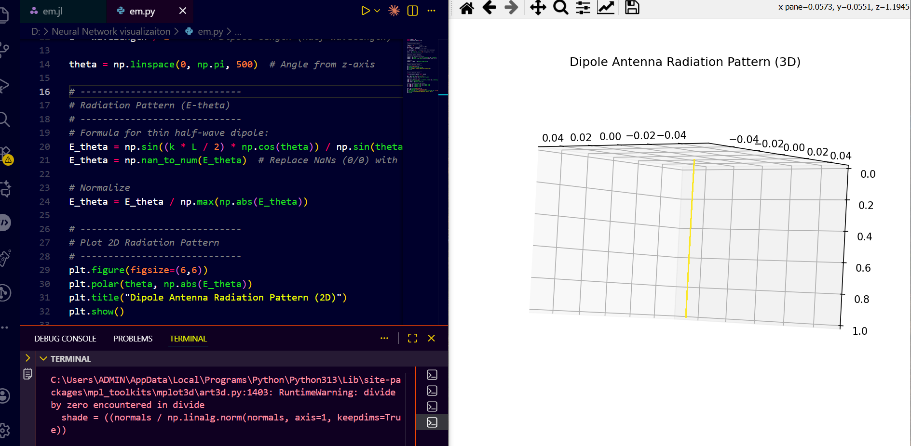

# Rayleigh-Bénard Convection (2D) Simulation in Julia




## Overview

This repository simulates **2D Rayleigh-Bénard convection** using the **Incompressible Navier-Stokes equations** coupled with a **temperature field** under the **Boussinesq approximation**. 

Hot and cold horizontal plates create buoyancy-driven flows, forming **convection rolls**. This simulation captures the **unsteady evolution** of fluid motion and temperature, visualized in real time using **GLMakie**.

### Features

- Fully unsteady 2D incompressible Navier-Stokes solver
- Coupled temperature equation for thermal convection
- Dirichlet and symmetric boundary conditions
- Non-uniform tanh-based grid stretching for high resolution near walls
- GPU/CPU backend support
- Real-time visualization of temperature and Nusselt numbers
- Output animations (MP4/GIF) of evolving temperature fields
- Tracking of average temperature profile and Nusselt number history

---

## Installation

Make sure you have **Julia 1.9+** installed. Then, add the required packages:

```julia
using Pkg
Pkg.add("GLMakie")
Pkg.add("IncompressibleNavierStokes")
